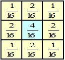
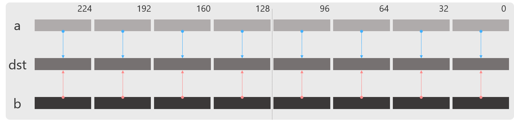
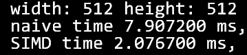

# imageProcessing
C++で実装しています  
一般的によく用いられている画像処理ライブラリであるOpenCVと、研究室で主に使われているライブラリのOpenCPを用いた実装です  
OpenCV(https://opencv.org/)  
OpenCP(https://github.com/norishigefukushima/OpenCP)

### SIMD演算　 
Single Instruction/Multiple Data (単一命令/複数データ)の略です  
1つの演算命令で複数のデータを同時に計算できる演算手法です 
今回は1つの命令で8つの画素を同時に計算しています

## GaussianFilter
計算が少し複雑になる代わりに、画像のエッジ(輪郭)を保持しつつ、ぼかすことができるフィルター実装です 
画像をぼかすことによって、ノイズのある画像に対してノイズの影響を抑えることができます。  
簡単な計算であるメディアンフィルタ(下部参考)と比べて輪郭が保持されていることが分かります。

左：ノイズを加えた画像  
右：左の画像にガウシアンフィルタをかけてぼかし、ノイズを軽減した画像  

## 実装
1. 処理に用いられる重みを計算します(mat4, mat8, mat16の画像)	 
重みは注目する画素と、その近傍の画素を用いて計算され、以下の画像のように計算します  

(引用：https://imagingsolution.net/imaging/gaussian/)  
2. 1で計算した重みを用いてガウシアンフィルタを計算します

### GaussianFilter_naive
通常のMat型(画像を格納する配列)を一つずつ計算します

### GaussianFilter_SIMD
SIMD演算を用いてMat型を8つずつ計算します

#### SIMD演算の例
_mm256_add_ps

## 演算速度結果
- naive実装：7.90ms
- SIMD実装：2.07ms  
およそ3.8倍の高速化を実現しています  

## 参考
左：メディアンフィルタ　右：ガウシアンフィルタ  

