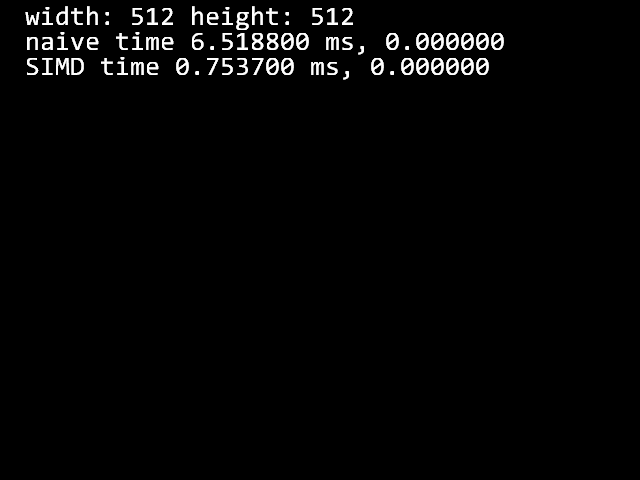

# imageProcessing

## GaussianFilter
- 画像のエッジ(輪郭)を保持しつつ、ぼかす

左：ノイズを加えた画像  
右：左の画像にガウシアンフィルタをかけてぼかし、ノイズを除去した画像

## 実装
1. 処理に用いられる重みを計算する(mat4, mat8, mat16の画像)	 
重み  

(引用：https://imagingsolution.net/imaging/gaussian/)
2. 1で計算した画像を用いてフィルタをガウシアンフィルタを計算する

### GaussianFilter_naive
通常のMat型(画像を格納する配列)を一つずつ計算

### GaussianFilter_SIMD
SIMD演算を用いてMat型を8つずつ計算

#### SIMD演算の例
_mm256_add_ps

## 演算速度結果
naive実装：6.51ms	SIMD実装：0.75ms  
およそ8.6倍の高速化  

## 参考
メディアンフィルタ  
